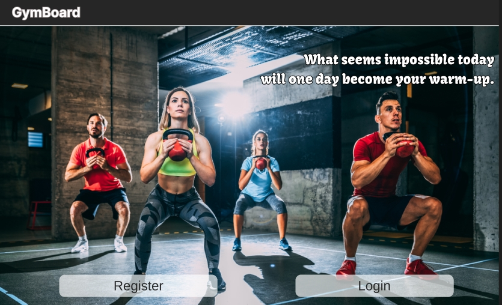

# GymBoard

==========================
## Description
GymBoard is a MERN stack-based gym class booking application that allows instructors to create and manage classes with available slots and images. Users can browse available classes, book their favorites, and cancel bookings as needed.

## Table of Contents

- [Features](#features)
- [Technologies Used](#technologies-used)
- [Installation](#installation)
- [Environment Variables](#environment-variables)
- [Usage](#usage)
- [API Endpoints](#api-endpoints)
- [Contributing](#contributing)
- [License](#license)

## Features

- **Instructor Dashboard**: Instructors can create, edit, and delete classes.
- **Class Management**: Add class descriptions, set available slots, and upload images.
- **User Booking**: Users can browse available classes, book, and cancel their bookings.
- **Responsive Design**: Fully responsive, user-friendly interface.
- **Authentication**: Secure user authentication using JWT tokens.
- **Admin Role**: Admins can manage users and their roles.

## Technologies Used

- **Frontend**: React, Bootstrap, React-Bootstrap, React-Router, Axios
- **Backend**: Node.js, Express.js, MongoDB, Mongoose
- **Authentication**: JSON Web Tokens (JWT))
- **Styling**: CSS, Bootstrap
- **Hosting**: (e.g., Render, Heroku, Netlify, etc.)


## Installation

### Prerequisites

- Node.js (>= 12.x)
- MongoDB

### Setup

1. Clone the repository:
 ``` bash 
 git clone https://github.com/AchmetCh/gymboard.git 
cd gymboard 
```


2. Install server dependencies:
``` bash
cd backend 
npm install
```


3. Install client dependencies
```bash 
cd ../client 
npm install
```

## Create a .env file in the backend directory and add the following:
```
MONGDODB_URI=your_mongodb_connection_string
PRIVATE_KEY=your_jwt_secret
SALT_ROUNDS=salt_round
```
## Usage
### Running the App
1. Start the backend server:
```
cd backend
npm start
```
2. Start the frontend development server:
```
cd client
npm start
```
3. Open your browser and navigate to http://localhost:8000.
- Frontend: You can deploy the frontend to platforms like Netlify or Vercel.
- Backend: Deploy the backend to platforms like Render or Heroku.
- Make sure to update the environment variables in your deployment environment.

## Contributing
Contributions are welcome! Please follow these steps:

- Fork the repository.
- Create a new branch (git checkout -b feature-branch).
- Make your changes.
- Commit your changes (git commit -m 'Add new feature').
- Push to the branch (git push origin feature-branch).
- Open a pull request.

## License
This project is licensed under the MIT License. See the LICENSE file for more details.

## Contact
Developed by Achmet Chasankil.

Feel free to contact me at:

- Email: gigsakos@gmail.com
- Linkedin: [Achmet Chasankil](https://www.linkedin.com/in/achmet-ch/)

